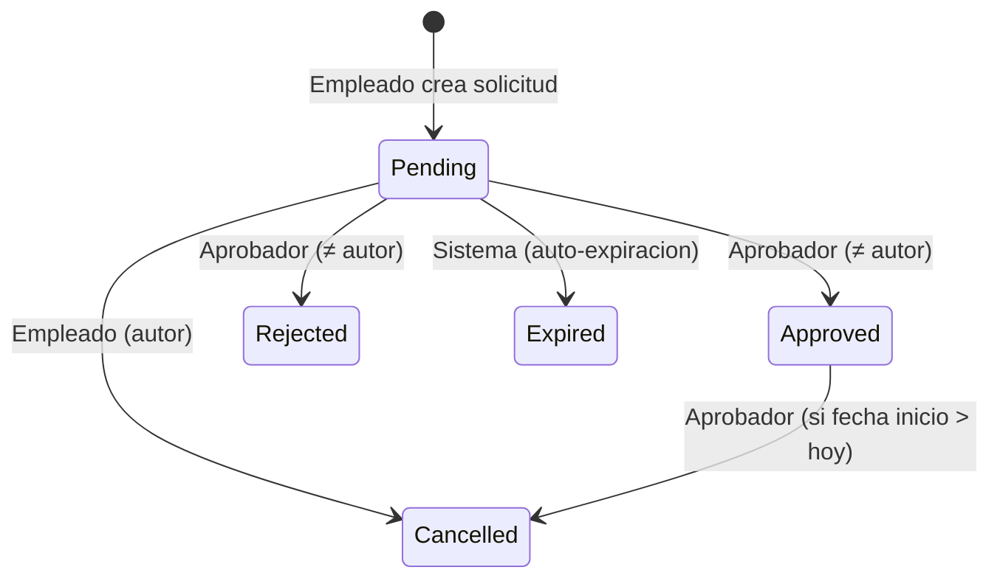

# Constitución Técnica — Sistema de Gestión de Solicitudes de Vacaciones

---

## 1. Actores y Ámbito de Acceso

Esta sección define los roles del sistema y el alcance de sus permisos. Todo comportamiento del sistema DEBE respetar estos límites.

| Actor | Ámbito de acceso |
|-------|------------------|
| **Empleado** | DEBE poder crear, consultar, editar y cancelar sus propias solicitudes en estado `Pending`. DEBE poder consultar su saldo e historial. NO DEBE poder ver solicitudes de otros empleados. |
| **Aprobador** | DEBE poder ver todas las solicitudes `Pending` del sistema (rol plano, sin jerarquía). DEBE poder aprobar o rechazar cualquier solicitud salvo las propias. DEBE poder cancelar solicitudes `Approved` cuyo periodo aún no haya iniciado. NO DEBE poder auto-aprobarse. |
| **RRHH** | DEBE tener acceso de solo lectura al historial y saldo de cualquier empleado. NO DEBE poder crear, editar, aprobar, rechazar ni cancelar solicitudes. |

Toda acción sobre el sistema DEBE validar el rol del actor autenticado antes de ejecutarse. Cualquier intento de acceso fuera del ámbito definido DEBE ser rechazado con HTTP 403 (Forbidden).

---

## 2. Estados y Transiciones

El ciclo de vida de una solicitud DEBE ajustarse al siguiente modelo de estados. Los estados terminales son inmutables una vez alcanzados.

### Reglas de transición

| Transición | Actor válido | ¿Inmutable después? |
|------------|-------------|---------------------|
| `Pending → Approved` | Aprobador activo (≠ autor) | Sí |
| `Pending → Rejected` | Aprobador activo (≠ autor) | Sí |
| `Pending → Cancelled` | Empleado (autor) | Sí |
| `Pending → Expired` | Sistema | Sí |
| `Approved → Cancelled` | Aprobador activo | Sí |

### Estados finales (inmutables)

Una vez que una solicitud alcanza `Approved`, `Rejected`, `Cancelled` o `Expired`, su estado NO DEBE cambiar bajo ninguna circunstancia, excepto la transición `Approved → Cancelled` documentada.

---

## 3. Principios de Arquitectura

El sistema DEBE seguir los principios de Clean Architecture y SOLID.

1. **Clean Architecture**: La capa de dominio NO DEBE tener dependencias de infraestructura, frameworks ni bases de datos. Las reglas de negocio DEBEN residir en el centro de la arquitectura.
2. **SOLID**: Cada clase DEBE tener una única responsabilidad. Las dependencias DEBEN invertirse: las capas externas DEBEN depender de abstracciones definidas en capas internas.
3. **Independencia de framework**: El dominio NO DEBE contener referencias a ASP.NET Core, Entity Framework ni ningún otro framework. Las dependencias externas DEBEN inyectarse en los bordes.
4. **Controladores delgados**: Los controladores MVC DEBEN limitarse a orquestar la interacción HTTP. NO DEBEN contener lógica de negocio ni de dominio. Toda lógica DEBE delegarse a servicios de aplicación o de dominio.
5. **Validación en el servidor**: Toda validación de negocio DEBE ejecutarse en el servidor. Las validaciones del cliente son solo para experiencia de usuario y NUNCA DEBEN considerarse como seguridad.
6. **Separación de tipos de validación**:
    - **Validación de entrada** (formato, campos requeridos, longitud, estructura de ViewModels/Commands/DTOs): se implementa con FluentValidation en la capa de Aplicación o Presentación. Es una validación sintáctica y de contrato, no de negocio.
    - **Regla de negocio** (saldo disponible, solape de fechas, transiciones de estado, autoridad del actor para aprobar/rechazar, políticas de fecha, restauración de saldo, etc.): DEBE implementarse en el Dominio. NUNCA DEBE delegarse a FluentValidation ni a ninguna librería de validación de entrada.

---

## 4. Convenciones de Nomenclatura

1. **Archivos de dominio (`Domain/`)**: En español, PascalCase. Ej.: `SolicitudVacaciones`, `SaldoEmpleado`.
2. **Archivos de aplicación (`Application/`)**: En español, PascalCase. Ej.: `CrearSolicitudHandler`, `AprobarSolicitudCommand`.
3. **Archivos de infraestructura (`Infrastructure/`)**: En español, PascalCase. Ej.: `VacationRequestRepository`.
4. **Controladores (`Controllers/`)**: En español, sufijo `Controller`. Ej.: `SolicitudVacacionesController`.
5. **Vistas (`Views/`)**: En español, coincidiendo con el nombre del controlador. Ej.: `Views/SolicitudVacaciones/`.
6. **Propiedades y métodos**: En español, PascalCase para públicos, `_camelCase` para privados.
7. **Parámetros y variables locales**: `camelCase` en español.
8. **Base de datos**: Tablas en español, PascalCase, singular. Columnas en español, PascalCase. Ej.: `SolicitudVacaciones.FechaInicio`.
9. **Rutas y endpoints**: En español, kebab-case. Ej.: `/solicitudes-vacaciones/pendientes`.
10. **Mensajes de validación y UI**: En español, con el texto exacto definido en las especificaciones.

---

## 5. Diagramas como Código (Mermaid.js)

Todo diagrama de estado, flujo o componente DEBE mantenerse como código Mermaid.js incrustado en Markdown. Los diagramas DEBENVersionarse junto con el código y actualizarse cuando cambie la lógica que representan.

El repositorio DEBE contener al menos los siguientes diagramas:

1. **Diagrama de máquina de estados** de la solicitud (incluido en la Sección 2 de esta constitución).
2. **Diagrama de casos de uso** (en `docs/use-case-diagrams.md`) que cubra los 19 casos de uso (CU-01 a CU-19).
3. **Diagrama de flujo de aprobación** que muestre las validaciones, descuento de saldo y registro de auditoría.

Estos diagramas DEBEN validarse en CI para detectar cambios no reflejados (ver Sección 10).

---

## 6. Restricciones Tecnológicas

1. **Framework**: ASP.NET Core MVC (versión LTS vigente). NO DEBEN usarse frameworks SPA (React, Angular, Vue) sin un ADR (Architecture Decision Record) aprobado.
2. **ORM**: Entity Framework Core.
3. **Base de datos**: SQL Server (o SQLite para desarrollo/pruebas).
4. **Autenticación**: ASP.NET Core Identity Framework.
5. **Dependencias de terceros aprobadas y restricción general**:
    - **FluentValidation**: queda APROBADO como dependencia estándar del proyecto para validación de entrada (formato, campos requeridos, longitud, estructura de ViewModels/DTOs). NO reemplaza las reglas de negocio del dominio (ver Sección 3.6).
    - Cualquier otra librería externa distinta a FluentValidation (ej. AutoMapper, Newtonsoft.Json, etc.) sigue requiriendo justificación documentada y aprobación del equipo antes de agregarse.
6. **Lenguaje**: C# para backend. HTML + Razor + CSS vanilla + JavaScript vanilla para frontend MVP.
7. **Zona horaria**: Zona horaria corporativa única. No se soportan zonas horarias múltiples.

---

## 7. Invariantes Universales

Los siguientes invariantes SON independientes de cualquier política de negocio. DEBEN cumplirse siempre, en todo entorno y para toda solicitud, sin excepción.

1. **Saldo aplicable no negativo**: El saldo disponible de un empleado NUNCA DEBE ser negativo. El sistema DEBE bloquear cualquier operación que produzca un saldo negativo.
2. **Fecha de inicio ≤ fecha de fin**: La fecha de inicio DEBE ser anterior o igual a la fecha de fin.
3. **Sin fechas pasadas en flujo normal**: Una solicitud nueva NO DEBE tener fecha de inicio en el pasado.
4. **Estado inicial**: Toda solicitud nueva DEBE crearse en estado `Pending`.
5. **Transiciones válidas**: Solo se DEBEN permitir las transiciones listadas en la Sección 2. Cualquier otra transición DEBE ser rechazada.
6. **Estados finales inmutables**: Una vez alcanzado un estado final (`Approved`, `Rejected`, `Cancelled`, `Expired`), el estado NO DEBE cambiar salvo la excepción documentada `Approved → Cancelled`.
7. **Prohibición de auto-aprobación**: Un aprobador NO DEBE poder aprobar ni rechazar su propia solicitud.
8. **Trazabilidad obligatoria**: Toda transición de estado DEBE generar un registro de auditoría inmodificable con actor, timestamp y tipo de evento.
9. **Cálculo de días en servidor**: El número de días solicitados DEBE calcularse siempre en el servidor. El sistema NUNCA DEBE confiar en un valor calculado por el cliente.

> **Políticas específicas**: Las políticas de negocio volátiles (tipos de permiso, reglas de saldo, excepciones médicas/legales, límite de solicitudes pendientes, medios días, acumulación y caducidad de saldo, delegación, correcciones retroactivas, etc.) se definen exclusivamente en las especificaciones de feature (`spec/`) correspondientes. La constitución, el código y cualquier herramienta de generación asistida por IA NO DEBEN asumir una respuesta para esas políticas si no existe una spec aprobada que las defina.

---

## 8. Seguridad

El sistema DEBE cumplir con las siguientes categorías priorizadas de OWASP Top 10 y las prácticas de seguridad detalladas.

### 8.1 Categorías OWASP priorizadas

| Categoría | Prácticas exigidas |
|-----------|-------------------|
| **A01 — Control de Acceso Roto** | Validación de roles en cada endpoint. Prohibición de auto-aprobación. Acceso a datos propios vs. ajenos verificado con el ID del usuario autenticado. |
| **A06 — Diseño Inseguro** | Toda validación de negocio DEBE ocurrir en el servidor. No DEBE confiarse en validación de cliente para seguridad. |
| **A09 — Fallas de Registro y Alertas de Seguridad** | Toda transición de estado e intento de acceso denegado DEBEN registrarse con auditoría inmutable. La auditoría de operaciones sobre saldo (`HistorialSaldo`) queda definida para una fase futura — fuera de alcance MVP. |

### 8.2 Configuración de cookies de sesión (ASP.NET Core Identity)

1. **HttpOnly**: `true` — la cookie NO DEBE ser accesible desde JavaScript.
2. **Secure**: `true` — la cookie SOLO DEBE enviarse por HTTPS.
3. **SameSite**: `Strict` o `Lax` según el contexto.
4. **Expiración/renovación**: La sesión DEBE expirar tras un periodo configurable de inactividad. El sistema DEBE renovar la cookie automáticamente mientras el usuario esté activo.

### 8.3 Protección contra overposting

Toda acción de escritura (crear, editar) DEBE usar ViewModels dedicados (`*ViewModel` o `*Dto`) en lugar de exponer la entidad del dominio directamente. El enlace de modelos DEBE limitarse a las propiedades permitidas explícitamente mediante `[Bind]` o su equivalente.

### 8.3.1 Ejecución de validadores FluentValidation

Los validadores de FluentValidation DEBEN resolverse vía inyección de dependencias (DI) y ejecutarse explícitamente mediante `ValidateAsync` desde el caso de uso de Aplicación o desde un filtro de acción propio del proyecto. NO DEBE utilizarse el pipeline de auto-validación de MVC (`AddFluentValidationAutoValidation`) ni la integración de cliente `FluentValidation.AspNetCore` (deprecada en versiones recientes). La ejecución explícita garantiza que la validación de entrada ocurra en el punto correcto del flujo y no interfiera con la validación de negocio del Dominio.

### 8.4 Gestión de secretos

Los secretos (connection strings, claves de cifrado, cadenas de Identity) NO DEBEN almacenarse en el repositorio. DEBEN gestionarse mediante Secret Manager en desarrollo y variables de entorno/Key Vault/Azure App Configuration en producción.

### 8.5 Cabeceras de seguridad en producción

La aplicación DEBE incluir las siguientes cabeceras HTTP en todas las respuestas de producción:

- **Content-Security-Policy (CSP)**: Restringir orígenes de scripts, estilos y fuentes.
- **Strict-Transport-Security (HSTS)**: Forzar HTTPS con `max-age` ≥ 1 año.
- **X-Content-Type-Options**: `nosniff`.
- **X-Frame-Options**: `DENY` (o `SAMEORIGIN` si se requiere iframe).

### 8.6 Rate limiting

El sistema DEBE implementar rate limiting proporcional al riesgo de cada endpoint. Como mínimo:
- **Endpoints de autenticación** (login): límite estricto (ej. 5 intentos/minuto por IP/usuario).
- **Endpoints de escritura** (crear/editar solicitudes): límite moderado.
- **Endpoints de lectura**: límite amplio.

### 8.7 Casos de abuso — pruebas obligatorias

Los siguientes escenarios DEBEN probarse explícitamente (como pruebas de seguridad) antes de cada release:

| Caso de abuso | Descripción |
|---------------|-------------|
| Acceso cruzado entre empleados | Empleado A intenta ver/editar solicitudes del Empleado B |
| IDOR | Modificar parámetros de ruta/query para acceder a recursos ajenos |
| Forced browsing | Acceder a rutas de aprobador siendo empleado (o viceversa) |
| Escalación de privilegios | Usuario sin rol intenta ejecutar acciones de aprobador |
| Auto-aprobación | Aprobador intenta aprobar su propia solicitud |
| Fallos de CSRF | Enviar solicitudes POST sin token anti-forgery válido |
| Transiciones duplicadas | Enviar la misma solicitud de aprobación/rechazo múltiples veces |
| Envíos duplicados | Crear la misma solicitud múltiples veces por concurrencia |

---

## 9. Pruebas y CI

### 9.1 Pirámide de pruebas

El sistema DEBE seguir la pirámide de pruebas clásica:

| Nivel | Tecnología | Cobertura esperada |
|-------|-----------|-------------------|
| **Unitarias** | xUnit + Moq / NSubstitute | Reglas de dominio, servicios de aplicación, validadores. Sin dependencias externas. |
| **Integración** | xUnit + WebApplicationFactory | Repositorios contra BD real (SQLite o SQL Server), controladores, middleware, pipeline completo de una solicitud. |
| **End-to-End (E2E)** | Playwright | Flujos críticos: crear solicitud, aprobar, rechazar, cancelar. Cubren HU-01 a HU-09. |

### 9.2 Meta de cobertura

- **Cobertura mínima**: 80 % en las capas de Dominio (`Domain/`) y Aplicación (`Application/`).
- Esta meta NO reemplaza la obligación de probar cada invariante universal (Sección 7) y cada criterio de aceptación de las especificaciones.
- La cobertura en Infraestructura y Presentación es deseable pero no tiene un mínimo exigido.

### 9.3 Gate de CI obligatorio

Antes de fusionar cualquier rama a `main`, el pipeline de CI DEBE ejecutar y pasar todos los siguientes gates. Si alguno falla, la fusión DEBE bloquearse.

| Gate | Herramienta |
|------|------------|
| Build | `dotnet build` sin errores ni warnings |
| Formato | `dotnet format --verify-no-changes` |
| Analizadores estáticos | .NET Roslyn analyzers + SonarCloud (si disponible) |
| Pruebas | `dotnet test` — todas las pruebas DEBEN pasar |
| Cobertura | `dotnet test --collect:"XPlat Code Coverage"` — mínimo 80 % en Dominio/Aplicación |
| Escaneo de dependencias | `dotnet list package --vulnerable` — cero vulnerabilidades conocidas |
| Validación de diagramas | Verificar que los archivos `.md` con diagramas Mermaid no tengan cambios no reflejados respecto a `main` |

---

## 10. Rendimiento y Operación

### 10.1 Objetivos de rendimiento

| Operación | Percentil 95 (p95) |
|-----------|-------------------|
| Consulta de saldo individual | ≤ 300 ms |
| Creación de solicitud | ≤ 1 s |
| Aprobación/rechazo | ≤ 1 s |
| Listado de solicitudes (paginado) | ≤ 2 s |
| Páginas MVC estándar | ≤ 500 ms |

### 10.2 Disponibilidad

- **Objetivo de disponibilidad**: 99.5 % (excluyendo ventanas de mantenimiento programado).
- **RTO (Recovery Time Objective)**: ≤ 4 horas.
- **RPO (Recovery Point Objective)**: ≤ 15 minutos.

### 10.3 Respaldo y recuperación

- La base de datos DEBE respaldarse automáticamente al menos una vez al día.
- Los respaldos DEBEN almacenarse en una ubicación distinta al servidor de producción.
- Se DEBE ejecutar una prueba de recuperación al menos una vez por trimestre.

---

## 11. Clasificación y Retención de Datos

### 11.1 Niveles de clasificación

| Nivel | Descripción | Ejemplos |
|-------|-------------|----------|
| **Público** | Información sin restricción | Nombres de roles, descripción del sistema |
| **Interno** | Uso dentro de la organización | Identificadores de solicitud, fechas |
| **Sensible / PII** | Datos personales o sensibles | Motivo de la solicitud, saldo de empleados |
| **Regulado** | Sujeto a normativa específica | Historial de auditoría (posible sujeción a legislación laboral) |

### 11.2 Período de retención por defecto

- Los registros de solicitudes y auditoría DEBEN conservarse durante el período que exija la legislación laboral aplicable (por defecto, 5 años desde la finalización del evento).
- Pasado ese período, los datos DEBEN anonimizarse o eliminarse según la política de la empresa.

### 11.3 Datos sensibles

El motivo de la solicitud (campo `Motivo`) PUEDE contener información médica del empleado. Este dato:
- DEBE clasificarse como **Sensible/PII**.
- DEBE ser visible solo para el empleado dueño de la solicitud, el aprobador autorizado que la resuelve y los usuarios de RRHH.
- NO DEBE exponerse en listados públicos y DEBE tratarse con el mismo nivel de protección que datos personales sensibles.

---

## 12. Gobernanza de Cambios

### 12.1 Proceso de enmienda

Todo cambio a las reglas definidas en esta constitución DEBE seguir el siguiente proceso:

1. **Propuesta**: Redactar el cambio propuesto con justificación.
2. **Revisión**: El cambio DEBE ser revisado por al menos un miembro del equipo de desarrollo y un representante del negocio (PO o líder funcional).
3. **Aprobación**: El cambio DEBE ser aprobado por el equipo antes de reflejarse en especificaciones, plan de trabajo o código.
4. **Actualización**: Una vez aprobado, la constitución DEBE actualizarse y su versión incrementarse. Todas las specs y planes afectados DEBEN sincronizarse.

### 12.2 Versionado

| Cambio | Tipo | Ejemplo |
|--------|------|---------|
| Adición, modificación o eliminación de un invariante universal | **MAJOR** | Cambiar la regla de inmutabilidad de estados finales |
| Adición de una nueva sección de gobernanza o seguridad | **MINOR** | Añadir rate limiting como requisito |
| Corrección de redacción, errores tipográficos o aclaraciones sin cambio de regla | **PATCH** | Corregir una referencia a una sección |

### 12.3 Excepciones

Toda excepción a una regla de esta constitución DEBE documentarse explícitamente en el pull request que la introduce. La documentación DEBE incluir:

- Regla afectada (sección y enunciado).
- Razón de la excepción.
- Riesgo identificado.
- Mitigación aplicada.
- Responsable de la decisión.
- Fecha de expiración de la excepción (si aplica).

Queda prohibida cualquier desviación silenciosa de las reglas de esta constitución.
