# Diagramas de Casos de Uso — Mermaid

> Generado desde `docs/use-cases.md` (v2 — 2026-07-27)
> `«actor»` = persona o sistema que inicia la acción

## Índice

| # | Caso de Uso | Actor(es) | Tipo |
|---|-------------|-----------|------|
| [CU-01](#cu01--crear-empleado-y-saldo-inicial) | Crear empleado y saldo inicial | Admin | Principal |
| [CU-02](#cu02--calcularacumular-saldo-mensual) | Calcular/acumular saldo mensual | Sistema_Acumulacion | Principal |
| [CU-03](#cu03--consultar-saldo-personal--histórico) | Consultar saldo personal / histórico | Empleado, RRHH | Principal |
| [CU-04](#cu04--registrar-movimientos-de-balance) | Registrar movimientos de balance | Sistema | Transversal |
| [CU-05](#cu05--crear-solicitud-pending) | Crear solicitud de vacaciones | Empleado | Principal |
| [CU-06](#cu06--ver-mis-solicitudes--detalle) | Ver mis solicitudes / detalle | Empleado | Principal |
| [CU-07](#cu07--editar-solicitud-pending) | Editar solicitud PENDING | Empleado | Principal |
| [CU-08](#cu08--cancelar-solicitud-por-empleado) | Cancelar solicitud (empleado) | Empleado | Principal |
| [CU-09](#cu09--cálculo-de-días-hábiles) | Cálculo de días hábiles | Sistema | Transversal |
| [CU-10](#cu10--prevención-de-traslapes) | Prevención de traslapes | Sistema | Transversal |
| [CU-11](#cu11--bandeja-de-aprobadores) | Bandeja de aprobadores | Aprobador | Principal |
| [CU-12](#cu12--aprobar-solicitud) | Aprobar solicitud | Aprobador | Principal |
| [CU-13](#cu13--rechazar-solicitud) | Rechazar solicitud | Aprobador | Principal |
| [CU-14](#cu14--ver-impacto-en-saldo) | Ver impacto en saldo | Aprobador | Extensión |
| [CU-15](#cu15--cancelar-approved-por-aprobador) | Cancelar APPROVED (aprobador) | Aprobador | Principal |
| [CU-16](#cu16--auto-expiración-pending--expired) | Auto-expiración PENDING → EXPIRED | Sistema_Expiracion | Principal |
| [CU-17](#cu17--gestión-de-roles-y-permisos) | Gestión de roles y permisos | Sistema | Transversal |
| [CU-18](#cu18--auditoría-y-trazabilidad-global) | Auditoría y trazabilidad global | Sistema | Transversal |
| [CU-19](#cu19--filtrado-y-consultas-para-rrhh) | Filtrado y consultas para RRHH | RRHH | Principal |
| [CU-20](#cu20--mensajes-ux-y-manejo-de-errores) | Mensajes UX y manejo de errores | Sistema | Transversal |

---

## CU-01 — Crear empleado y saldo inicial

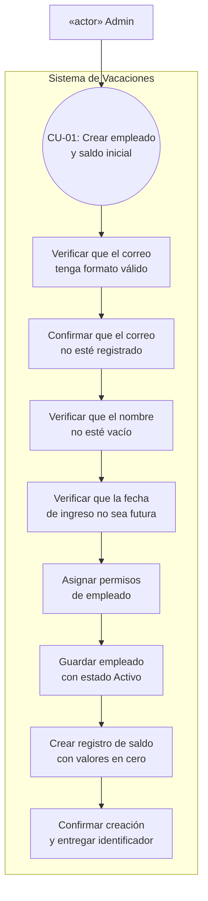

---

## CU-02 — Calcular/acumular saldo mensual

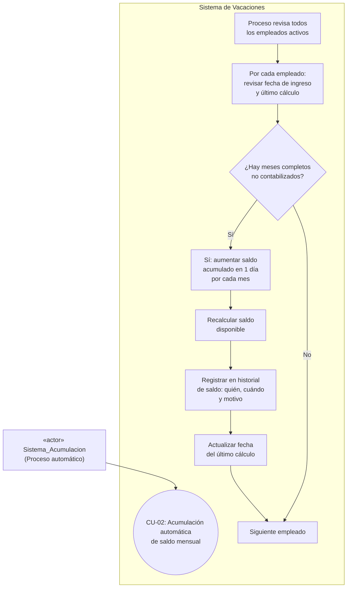

---

## CU-03 — Consultar saldo personal / histórico

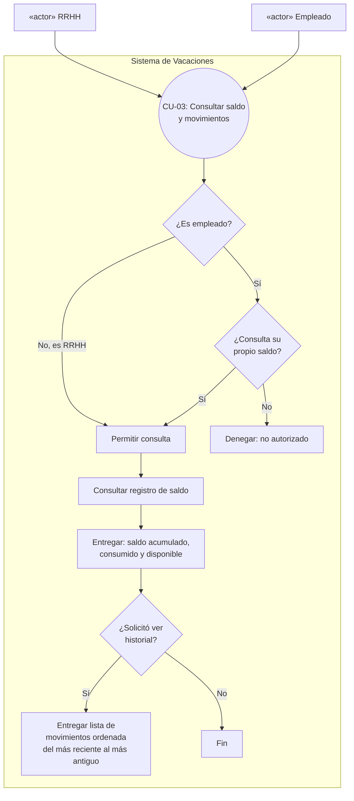

---

## CU-04 — Registrar movimientos de balance

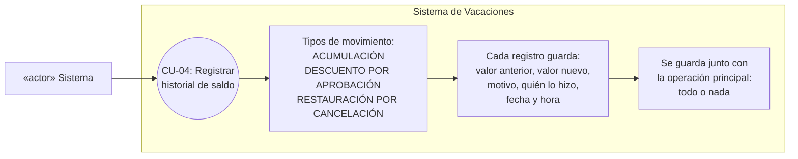

---

## CU-05 — Crear solicitud PENDING

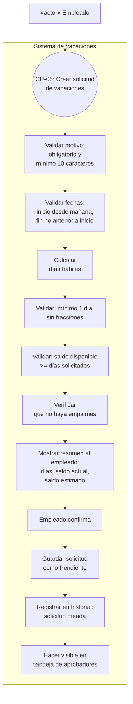

---

## CU-06 — Ver mis solicitudes / detalle

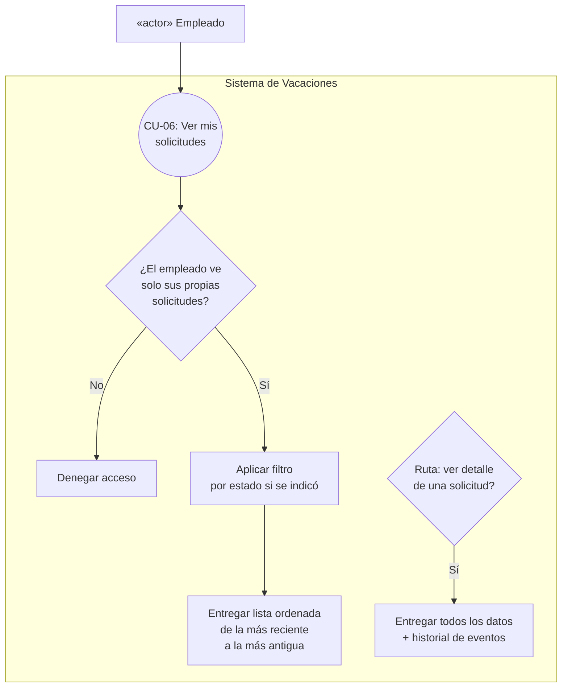

---

## CU-07 — Editar solicitud PENDING

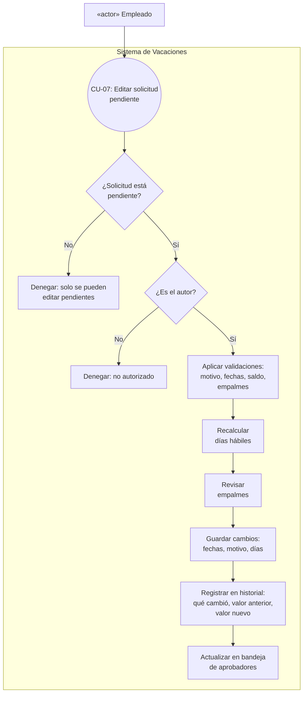

---

## CU-08 — Cancelar solicitud por empleado

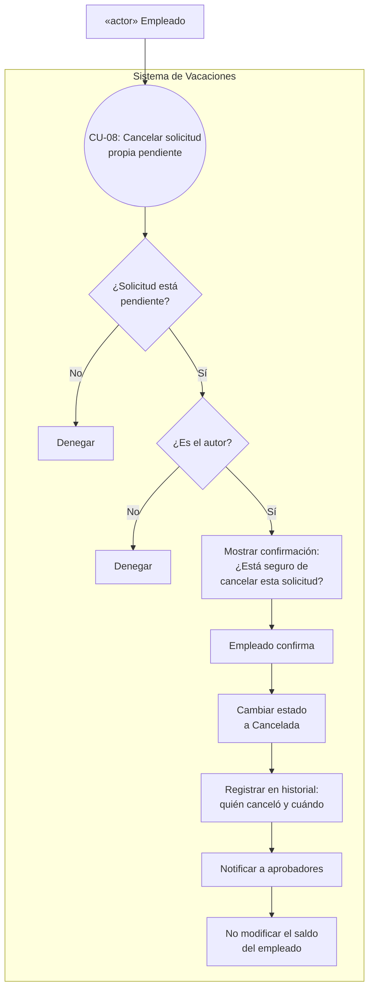

---

## CU-09 — Cálculo de días hábiles

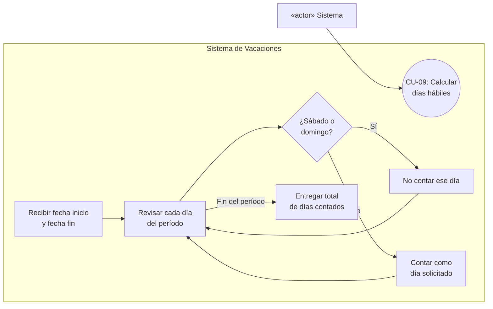

---

## CU-10 — Prevención de traslapes

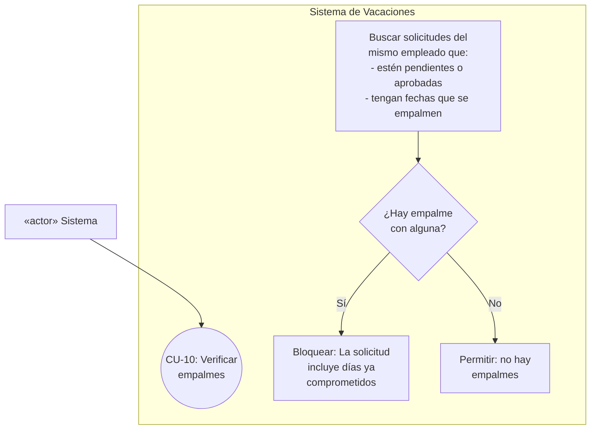

---

## CU-11 — Bandeja de aprobadores

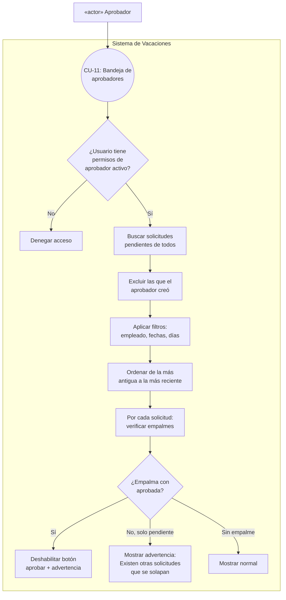

---

## CU-12 — Aprobar solicitud

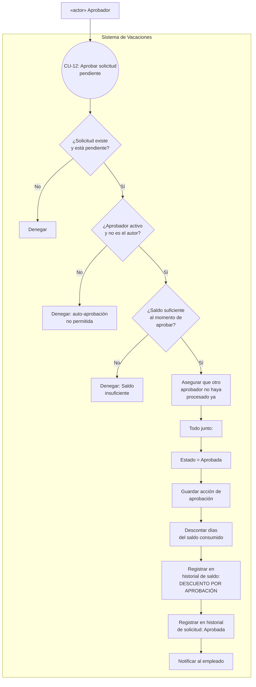

---

## CU-13 — Rechazar solicitud

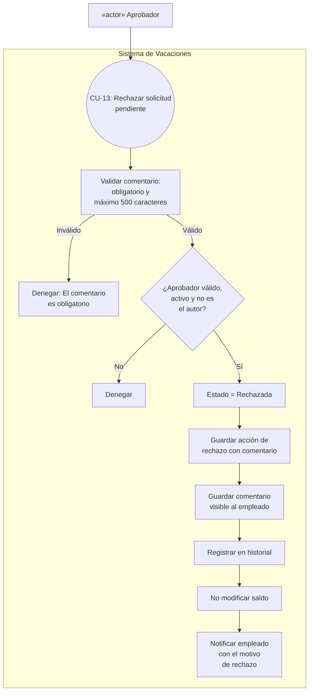

---

## CU-14 — Ver impacto en saldo

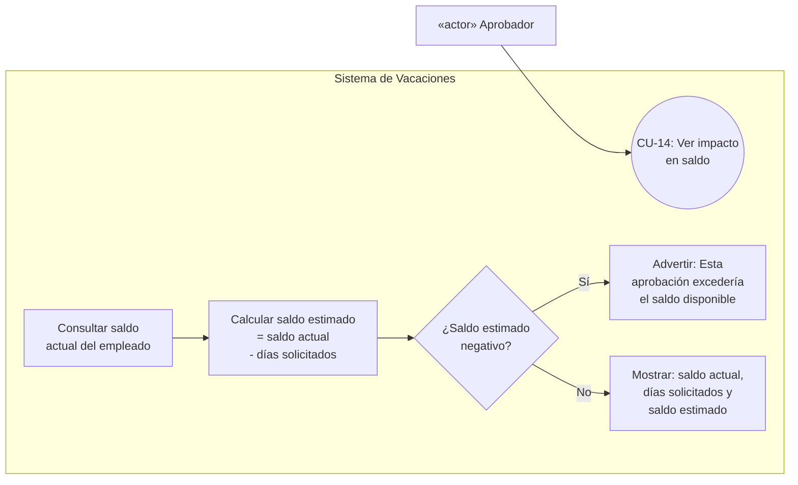

---

## CU-15 — Cancelar APPROVED por aprobador

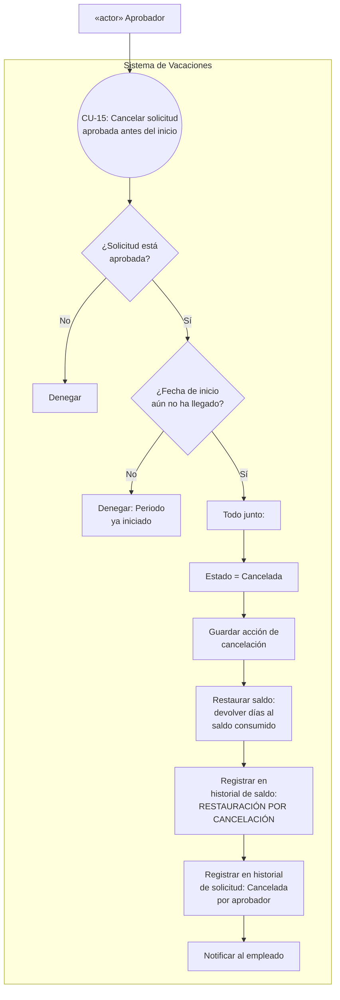

---

## CU-16 — Auto-expiración PENDING → EXPIRED

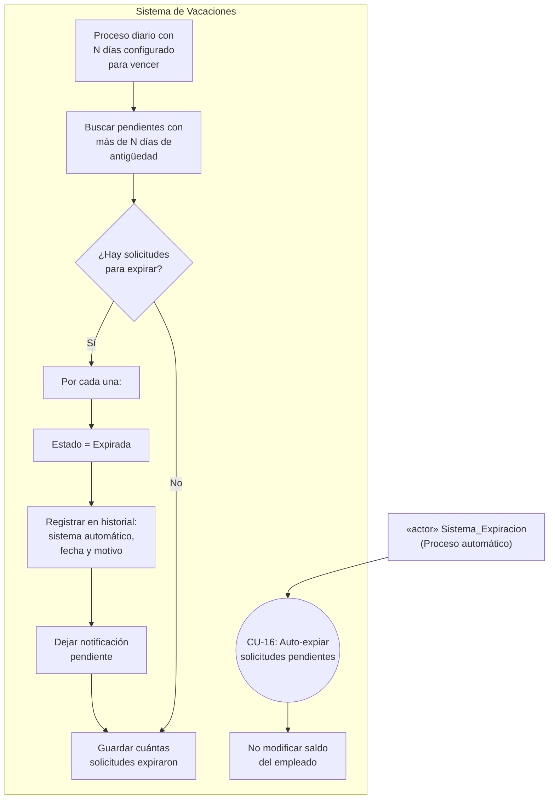

---

## CU-17 — Gestión de roles y permisos

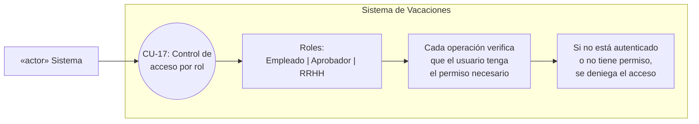

---

## CU-18 — Auditoría y trazabilidad global

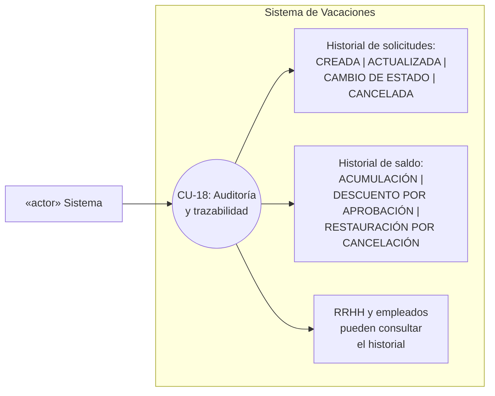

---

## CU-19 — Filtrado y consultas para RRHH

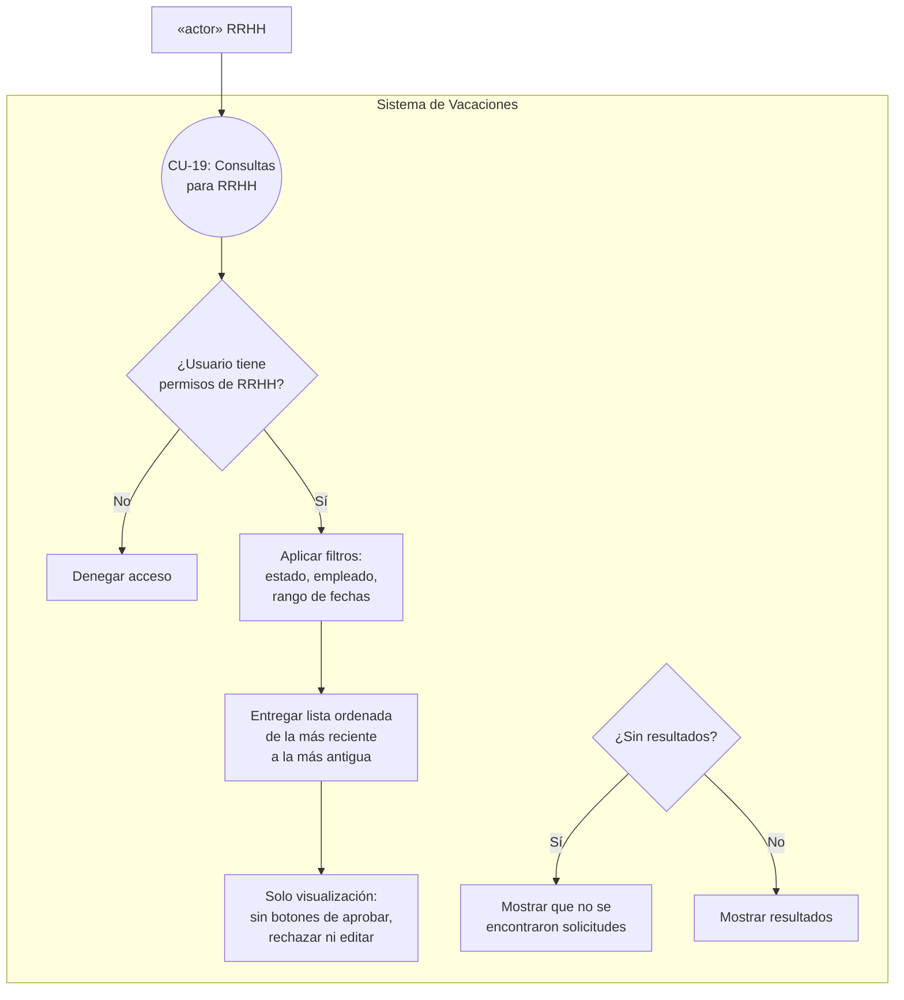

---

## CU-20 — Mensajes UX y manejo de errores

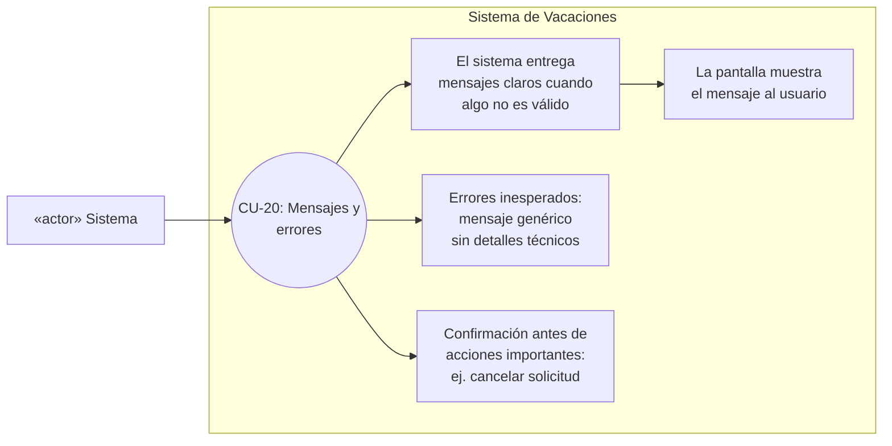
